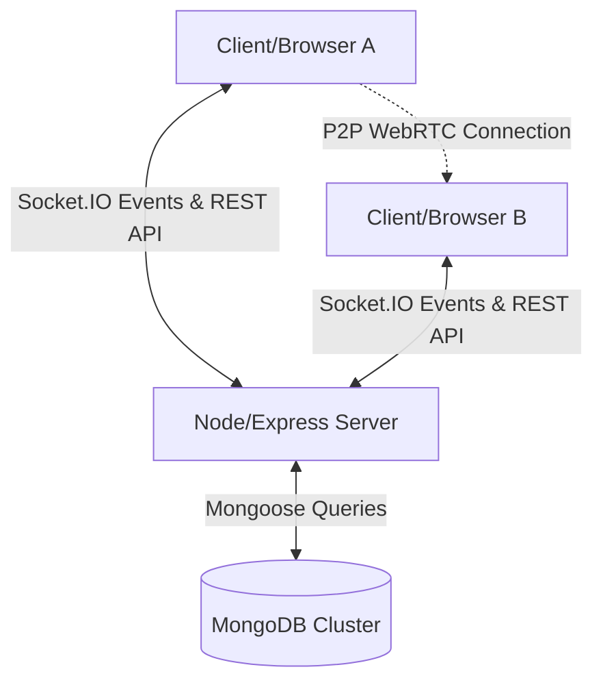

# 💬 GuppShup Chat - Real-Time Chat & Video Calling Application

GuppShup Chat is a premium, full-stack real-time chat application engineered for high-concurrency instant messaging, persistent history, and peer-to-peer WebRTC video/voice communications. It is built using the MERN stack (MongoDB, Express, React, Node.js) paired with Socket.IO for duplex communication and styled with modern Tailwind CSS and glassmorphism design aesthetics.

---

## 🚀 Key Features

*   **⚡ Real-Time Private Messaging:** Instant, bi-directional message delivery with Socket.IO.
*   **🎥 WebRTC Voice & Video Calling:** Peer-to-peer direct audio and video signaling for real-time calls.
*   **🔒 Secure Authentication:** Cookie-based JWT authentication paired with hashed passwords via bcrypt.
*   **📊 Live User Status & Typing Indicators:** Dynamic online list synced with a user-status mapping (`Active`, `Away`, `Do Not Disturb`), accompanied by real-time typing events.
*   **📖 Read Receipts & Sync:** Real-time messages read receipts (`isRead` flags) synchronized across multiple tabs and sessions.
*   **💾 Persistent Message History:** Fully persistent conversation history mapped via MongoDB schemas.
*   **✨ Premium Glassmorphic UI:** Smooth micro-animations, theme toggling, custom backgrounds, and responsive layouts for mobile and desktop viewports.

---

## 🛠️ Technology Stack

| Layer | Technology | Purpose |
| :--- | :--- | :--- |
| **Frontend** | React (Vite), JavaScript | High-performance SPA with fast hot module replacement (HMR) |
| **Styling** | Tailwind CSS | Utility-first styling for quick, responsive glassmorphism interfaces |
| **State** | Zustand | Lightweight and decoupled global state management |
| **Backend** | Node.js, Express.js | Scalable API routing, rate-limiting, and middleware orchestration |
| **Real-Time** | Socket.IO (WebSockets) | Event-driven duplex signaling for messages, statuses, and WebRTC |
| **Database** | MongoDB, Mongoose | Document database for flexible user, message, and conversation schemas |
| **Security** | JWT, Cookie-Parser, Helmet | Secure session tokens via HttpOnly cookies, secure headers, and CORS config |

---

## 📐 System Architecture



### Flow Walkthrough
1. **Handshake & Session:** Client authenticates via `/api/auth/login`. On success, the server issues a JWT cookie and initializes a persistent Socket.IO connection passing the `userId` query parameter.
2. **Duplex Messaging:** When Client A sends a message:
   * It is posted via REST API to `/api/messages/send/:id` for database persistence.
   * Simultaneously, the server identifies Client B's active socket IDs via `userSocketMap[receiverId]` and pushes the message in real-time.
3. **WebRTC Signaling:** Socket.IO acts as the signaling channel (`callUser`, `answerCall`, `iceCandidate`) to exchange session descriptors between peers, enabling direct, high-bandwidth P2P video streaming.

---

## 📄 Professional Resume Bullet Points

*   **Full-Stack Development:** Engineered a high-performance, real-time chat application utilizing **React.js**, **Node.js**, **Express.js**, and **MongoDB/Mongoose**, integrating dynamic glassmorphism UI components with custom-tailored **Tailwind CSS**.
*   **Real-Time Architecture:** Implemented **Socket.IO** server-side and client-side to manage active socket mapping arrays, powering seamless multi-tab synchronization, real-time typing indicators, active status changes, and global read-receipt updates with sub-100ms latency.
*   **P2P WebRTC Integration:** Integrated **WebRTC** signaling protocols through Socket.IO events (`callUser`, `answerCall`, `iceCandidate`), facilitating direct peer-to-peer audio and video communication without routing media traffic through the server.
*   **Authentication & Security:** Deployed stateless **JWT authentication** stored securely inside client-side `HttpOnly` cookies to block cross-site scripting (XSS), utilizing **Helmet** security headers, dynamic **CORS** configurations, and production-mode **rate limiters** to secure endpoints.

---

## ⚙️ Installation & Setup

### Prerequisites
*   **Node.js** (v18+)
*   **MongoDB Atlas** or a local MongoDB database instance

### Backend Configuration
1. Navigate to the `backend` folder:
   ```bash
   cd backend
   ```
2. Install dependencies:
   ```bash
   npm install
   ```
3. Create a `.env` file inside the `backend` directory:
   ```env
   PORT=5000
   MONGO_DB_URI=your_mongodb_connection_string
   JWT_SECRET=your_jwt_secret_key
   ```
4. Start the backend server:
   ```bash
   npm start
   ```

### Frontend Configuration
1. Navigate to the `frontend` folder:
   ```bash
   cd ../frontend
   ```
2. Install dependencies:
   ```bash
   npm install
   ```
3. Run the development server:
   ```bash
   npm run dev
   ```
4. Access the application at `http://localhost:5173`.
